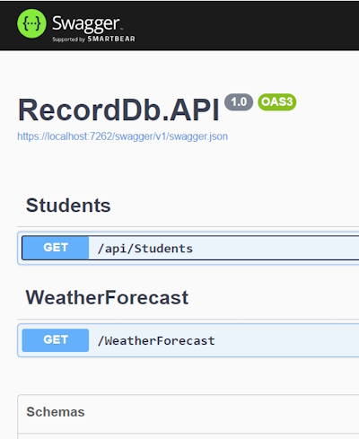
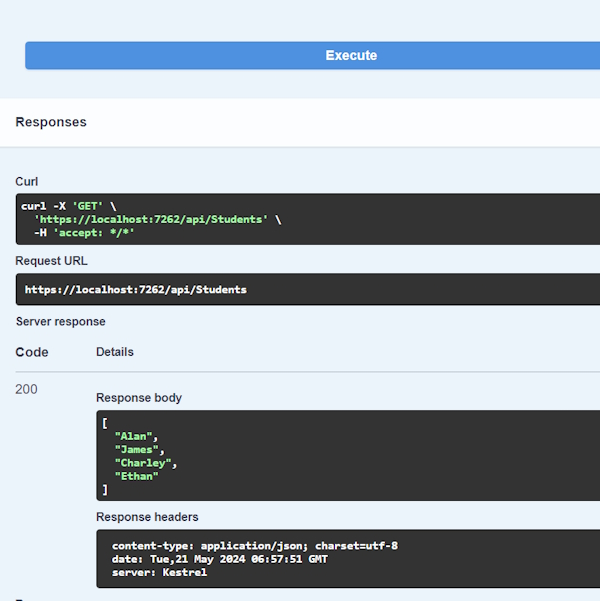
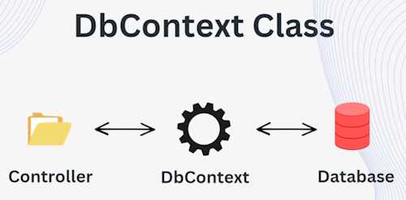

# Create New ASP.NET Core Web API & Domain Models

## Create a new Web API Project


### Location

> D:\Projects\RecordDbWeb

### Project

> RecordDb.API

We are using ``Controllers`` for this project.

## Add Packages

> Microsoft.EntityFrameworkCore.SqlServer       
> Microsoft.EntityFrameworkCore.Tools

## HTTP Verbs

HTTP Verbs define the types of actions that can be performed on a resource identified by a URI.

* GET
* POST
* PUT
* DELETE
* PATCH
* OPTIONS

**GET:** <https://yourapi.com/api/employees> *(Get All Employees)*

**GET:** <https://yourapi.com/api/employees/{id}> *(Get Single Employee by Id)*

**POST:** <https://yourapi.com/api/employees> *(Create and Employee)*

**PUT:** <https://yourapi.com/api/employees/{id}> *(Update an Employee by Id)*

**DELETE:** <https://yourapi.com/api/employees> *(Delete an Employee by Id)*

## Routing

> **Delete Employee**
>   **DELETE**
> **<https://yourapi.com/api/employees/5>**

Translates to

```bash
    [httpDelete("{id}")]
    public IActionResult Delete(int id)
    {
        // delete the employee by Id
    }
```

## Creating a Controller

Right-click on the ``Controllers`` folder in Visual Studio.

Click on ``Add``-->``Controller`` then click on ``API`` and then ``API.Controller - Empty``.


Name your Controller ``StudentsController.cs``. Once you save this it will scaffold the following code.

```bash
    using Microsoft.AspNetCore.Http;
    using Microsoft.AspNetCore.Mvc;

    namespace RecordDb.API.Controllers
    {
        [Route("api/[controller]")]
        [ApiController]
        public class StudentsController : ControllerBase
        {
        }
    }
```

**Note:** a controller will always have plural name prefix with the word ``Controller``. This is the standard for a controller.

This is the route for the controller.

```bash
    [Route("api/[controller]")]
```

When you create a **GET** endpoint it will have the link (it is the Uri to the controller),

```bash
    https://localhost:1234/api/students
```

Where ``/[controller]`` represents the name of the controller (in our case ``students``).

Now we can create a ``GET`` action method.

```bash
    // Get: https://localhost:1234/api/students
    [HttpGet]
    public IActionResult GetAllStudents()
    {
        string[] studentNames = { "Alan", "James", "Charley", "Ethan" };

        return Ok(studentNames);
    }
```

This creates a **GET** endpoint and when we go to the Swagger page we will see this.



Trying and clicking Execute will show this.



The results show our response which is our JSON array of students. Note that you will also see the Uri for our endpoint.

```bash
    https://localhost:7262/api/Students
```

And a 200 response to show us that the response was successful.

Now we know how our routing works and how to consume an API using Swagger. An alternate way to consume our API is you use Postman.

## Creating a Project and Domain Models

Now, we are going to create a real API in our project. Our Domain models will be from an existing database and will be,

* Artist
* Record

Create a ``Models`` folder and then in here another folder named ``Domain``.

Create new classes in ``Domain`` for ``Artist`` and ``Record``.

## Create a DbContext class

A DbContext class will allow us to.

* Maintain a connection to the RecordDB database
* Track changes
* Perform CRUD operations
* Bridge between Domain models and the database

The DbContext class is a bridge between the Domain Models and the Database.



Create a new folder named **Data** and a class named ``RecordDbContext``.

This class inherits from the ``DbContext`` class. It is part of the EntityFrameworkCore package.

Create a constructor in the class and we want to add DbContext options to the class.

```bash
    public class RecordDbContext: DbContext
    {
        public RecordDbContext(DbContextOptions dbContextOptions): base(dbContextOptions)
        {
            
        }
    }
```

Now we want to create ``DbSets``. A DbSet is a property of the ``DbContext`` class that represents a collection of entities in the database.

In our application we have two entities or Domain models and they are ``Artist`` and ``Record`` and we want to make DbSets of these entities. We will do this in the ``DbContext``.

```bash
    public class RecordDbContext: DbContext
    {
        public RecordDbContext(DbContextOptions dbContextOptions): base(dbContextOptions)
        {
            
        }

        public DbSet<Artist> Artist { get; set; }

        public DbSet<Record> Record { get; set; }
    }
```

## Create a Connection string

We will do this in the ``appsettings.json`` file in the root folder.

```bash
  "ConnectionStrings": {
    "RecordDb": "Server=TIGER;Database=RecordDB;Trusted_Connection=True;TrustServerCertificate=True"
  }
```

## Dependency Injection

Dependency Injection is a design pattern used to increase the maintainability of applications by reducing the coupling between components. Dependency injection is used to manage the lifetime ane dependency of services used throughout the application.

Dependency Injection works on the fundamental that instead of instantiating objects within a class those objects are passed in as parameters into the class by passing them to the constructor or a method instead. This allows for greater flexibility in the way objects are created and managed.

ASP.Net core contains a Dependency Injection container that can be used to manage the dependencies of an application. Dependency Injection container is responsible for creating and managing instances of services which are registered with the container when the application starts.

Dependency Injection is:

* A design pattern to increase maintainability and testability
* Dependency Injection is built into ASP.Net Core
* Dependency Injection is responsible for creating and managing instances

Let's look at an example without Dependency Injection.

```bash
    public class MyController: ControllerBase
    {
        private readonly MyService _service;

        public MyController()
        {
            _service = new MyService();
        }

        public IActionResult Index()
        {
            var data = _service.GetData();

            return Ok(Data);
        }
    }
```

In the example above we are instantiating the service in the constructor. The class will have to be managed by the controller. Later on in the future if we have to rename the class or have to use a different implementation of ``MyService`` we have to change all the controllers and classes that use ``MyService``.

Instead of creating the instance of creating the instance within the class this is what Dependency Injection does. We can easily inject the interface ``IMyService`` inside our application in the ``Program.cs`` file and we also provide the implementation detail of the interface (``MyService``) which is what we are trying to implement. So ``MyService`` has been injected inside the application.

```bash
    services.AddScoped<IMyService, MyService>();
```

Inside the controller or any controller that we want to use ``MyService`` we can easily inject the service as a parameter to the controller or as a parameter to the method. And then we can use this service throughout the application, for example in the ``Index`` method.

An example with Dependency Injection.

```bash
    public class MyController: ControllerBase
    {
        private readonly IMyService _service;

        public MyController(IMyService service)
        {
            _service = service;
        }

        public IActionResult Index()
        {
            var data = _service.GetData();

            return Ok(Data);
        }
    }
```

This is a good practice and it also satisfies the **D** in SOLID. By doing this we can easily change the implementation of ``MyService`` to another service implementation in the ``Program.cs`` file in just one place and then later on all of the controllers can implement the new implementation which is now managed and provided by the application.

Now we can inject our ``RecordDb`` context inside the application so that later on we can use the context class inside controllers or repositories.

In ``Program.cs`` we already have a few services that have been injected by default including Swagger. After this we want to inject our DbContext class.

```bash
    var builder = WebApplication.CreateBuilder(args);

    // Add services to the container.
    builder.Services.AddControllers();
    // Learn more about configuring Swagger/OpenAPI at https://aka.ms/aspnetcore/swashbuckle
    builder.Services.AddEndpointsApiExplorer();
    builder.Services.AddSwaggerGen();
    
    builder.Services.AddDbContext<RecordDbContext>(options => 
        options.UseSqlServer(builder.Configuration.GetConnectionString("RecordDb")));
    
    var app = builder.Build();
```

We have injected our DbContext class which is kept in the Data folder and named ``RecordDbContext.cs``. We also added an option to get the connection string from ``appsettings.json``. This is part of EntityFrameworkCore.

Now the application will manage all of the instances of the DbContext class whenever we call it inside of controllers or repositories.
