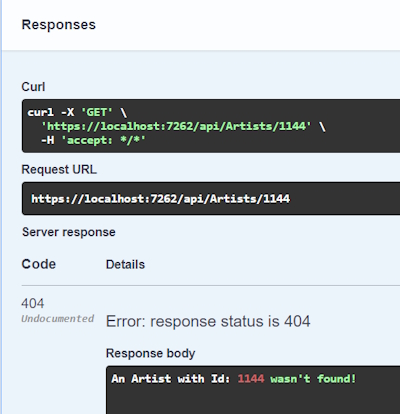

# Create New Artist Controller, CRUD Operations &amp; Action Methods

**Note:** My RecordDb database is an existing database and was made with singular table names. For this reason my ``DbSet`` names are singular as well. In ASP.Net Core and EntityFramework the Domains are usually plural.

## Create the Artists Controller

Remember to use the Empty API Controller template.

```bash
    namespace RecordDb.API.Controllers
    {
        [Route("api/[controller]")]
        [ApiController]
        public class ArtistsController : ControllerBase
        {    
        }
    }
```

The annotations are important (using an API Controller template creates these).

> [Route("api/[controller]")]

This annotation denotes the route for the controller. In our case this will be.

> <https://localhost:1234/api/artists>

This Url is going to the ``artists`` controller.

``artists`` is from the prefix of the controller name (ArtistsController.cs).

We could also change this annotation to.

> [Route("api/artists")]

And it would work just the same.

The following annotation denotes that the controller is an API controller (not an MVC controller).

> [ApiController]

**Note:** if this annotation is missing you won't see any endpoints in Swagger.

## Creating a DbContext

We will create a DbContext to retrieve our Artist data using  constructor injection.

```bash
    private readonly RecordDbContext dbContext;

    public ArtistsController(RecordDbContext dbContext)
    {
        this.dbContext = dbContext;
    }
```

Now we can use the ``dbContext`` in our Action methods.

## Creating an Action Method

This is the route to get all Artists.

```bash
    // GET: https://localhost:1234/api/artists
    [HttpGet]
    public async Task<IActionResult> GetAll()
    {
        var artists = await dbContext.Artist.ToListAsync();

        return Ok(artists);
    }
```

We use a ``[HttpGet]`` verb as our attribute.

We have access to our two domains through our ``dbContext`` so we can bring back the Artist data using the ToListAsync() method.

Run the code and a Swagger page will appear in your browser.


When you execute this endpoint it will return.


The data is returned as JSON.

```bash
    {
        "artistId": 1,
        "firstName": "William",
        "lastName": "Ackerman",
        "name": "William Ackerman",
        "biography": "<p>Will Ackerman has gained..."
    },
```

Also note that the Swagger returns a ``Url`` and a ``curl`` instruction and you can use either of these to return data.

> <https://localhost:7262/api/Artists>

And.

> curl -X 'GET' '<https://localhost:7262/api/Artists>' -H 'accept: */*'

## Getting an Artist by Id

For this Action method we will have to supply an ``Id`` to return a single Artist.

```bash
    // GET: https://localhost:1234/api/artists/114
    [HttpGet]
    [Route("{id:int}")]
    public async Task<IActionResult> GetById([FromRoute] int id)
    {   
        var artist = await dbContext.Artist.FindAsync(id);

        if (artist == null)
        {
            return NotFound($"An Artist with Id: {id} wasn't found!");

        return Ok(artist);
    }
```

### Code breakdown

Once again we are using a ``[HttpGet]`` verb.

This time we need to receive a parameter of ``Id`` to find a particular Artist. We do this by adding a ``Route`` attribute in this format.

> [Route("{id:int}")]

**Note:** the parameter name (``id``) in the Route **must** match the method's input parameter (see below).

```bash
    [Route("{id:int}")]
    public async Task<IActionResult> GetById([FromRoute] int id)
    {
        ...
    }
```

Also note that in the Route attribute we can make the parameter type safe by adding the ``int`` type.

In the method signature we know that the parameter is coming in from the Route so we can use the property ``[FromRoute]`` in front of the input parameter.

The next line allows us to find and return the Artist record if it is found.

```bash
    var artist = await dbContext.Artist.FindAsync(id);
```

The ``FindAsync()`` method requires an input parameter that has to be the Primary Key for the Entity.

We can also use the following method to return the Artist record.

```bash
    var artist = await dbContext.Artist.FirstOrDefaultAsync(a => a.ArtistId == id);
```

In this statement we use a LINQ query method, ``.FirstOrDefault()`` where we query the input parameter against the parameter in the database.

The benefit of using this method is that we are not tied to using just the ``id`` as a parameter. We could also use other parameters for the search such as the ``Name`` parameter, for example.

```bash
    // GET: https://localhost:1234/api/artists/Yes
    [HttpGet]
    [Route("{name:alpha}")]
    public async Task<IActionResult> GetById([FromRoute] string name)
    {
        var artist = await dbContext.Artist.FirstOrDefaultAsync(a => a.Name == name);
    
        if (artist == null)
        {
            return NotFound($"An Artist with Name: {name} wasn't found!");
        }
    
        return Ok(artist);
    }
```

Once we have returned the result we need to test that a valid Artist has been returned.

In the following code we have returned a response of **200** which means success. We code this with.

```bash
    return Ok(artist);
```

This returns.


If nothing has been returned we can report the error with a response of 404, Not Found with this code.

```bash
    return NotFound($"An Artist with Name: {name} wasn't found!");
```


