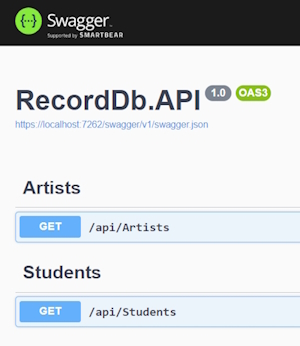
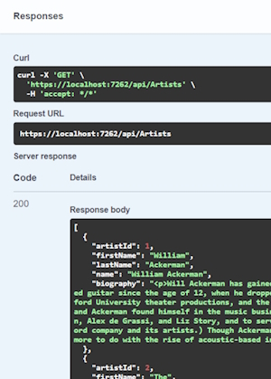
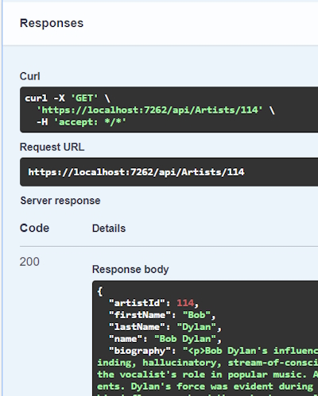
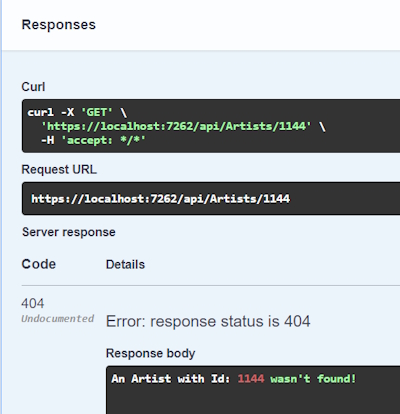
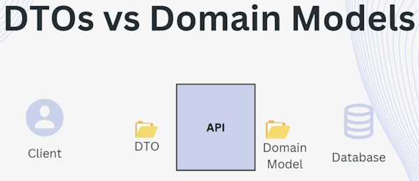
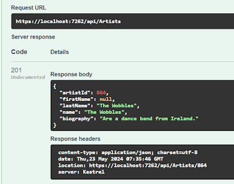

# Create New Artist Controller, CRUD Operations &amp; Action Methods

**Note:** My RecordDb database is an existing database and was made with singular table names. For this reason my ``DbSet`` names are singular as well. In ASP.Net Core and EntityFramework the Domains are usually plural.

## Create the Artists Controller

Remember to use the Empty API Controller template.

```bash
    namespace RecordDb.API.Controllers
    {
        [Route("api/[controller]")]
        [ApiController]
        public class ArtistsController : ControllerBase
        {    
        }
    }
```

The annotations are important (using an API Controller template creates these).

> [Route("api/[controller]")]

This annotation denotes the route for the controller. In our case this will be.

> <https://localhost:1234/api/artists>

This Url is going to the ``artists`` controller.

``artists`` is from the prefix of the controller name (ArtistsController.cs).

We could also change this annotation to.

> [Route("api/artists")]

And it would work just the same.

The following annotation denotes that the controller is an API controller (not an MVC controller).

> [ApiController]

**Note:** if this annotation is missing you won't see any endpoints in Swagger.

## Creating a DbContext

We will create a DbContext to retrieve our Artist data using  constructor injection.

```bash
    private readonly RecordDbContext dbContext;

    public ArtistsController(RecordDbContext dbContext)
    {
        this.dbContext = dbContext;
    }
```

Now we can use the ``dbContext`` in our Action methods.

## Creating an Action Method

This is the route to get all Artists.

```bash
    // GET: https://localhost:1234/api/artists
    [HttpGet]
    public async Task<IActionResult> GetAll()
    {
        var artists = await dbContext.Artist.ToListAsync();

        return Ok(artists);
    }
```

We use a ``[HttpGet]`` verb as our attribute.

We have access to our two domains through our ``dbContext`` so we can bring back the Artist data using the ToListAsync() method.

Run the code and a Swagger page will appear in your browser.



When you execute this endpoint it will return.



The data is returned as JSON.

```bash
    {
        "artistId": 1,
        "firstName": "William",
        "lastName": "Ackerman",
        "name": "William Ackerman",
        "biography": "<p>Will Ackerman has gained..."
    },
```

Also note that the Swagger returns a ``Url`` and a ``curl`` instruction and you can use either of these to return data.

> <https://localhost:7262/api/Artists>

And.

> curl -X 'GET' '<https://localhost:7262/api/Artists>' -H 'accept: */*'

## Getting an Artist by Id

For this Action method we will have to supply an ``Id`` to return a single Artist.

```bash
    // GET: https://localhost:1234/api/artists/114
    [HttpGet]
    [Route("{id:int}")]
    public async Task<IActionResult> GetById([FromRoute] int id)
    {   
        var artist = await dbContext.Artist.FindAsync(id);

        if (artist == null)
        {
            return NotFound($"An Artist with Id: {id} wasn't found!");

        return Ok(artist);
    }
```

### Code breakdown

Once again we are using a ``[HttpGet]`` verb.

This time we need to receive a parameter of ``Id`` to find a particular Artist. We do this by adding a ``Route`` attribute in this format.

> [Route("{id:int}")]

**Note:** the parameter name (``id``) in the Route **must** match the method's input parameter name (see below).

```bash
    [Route("{id:int}")]
    public async Task<IActionResult> GetById([FromRoute] int id)
    {
        ...
    }
```

Also note that in the Route attribute we can make the parameter type safe by adding the ``int`` type.

In the method signature we know that the parameter is coming in from the Route so we can use the property ``[FromRoute]`` in front of the input parameter.

The next line allows us to find and return the Artist record if it is found.

```bash
    var artist = await dbContext.Artist.FindAsync(id);
```

The ``FindAsync()`` method requires an input parameter that has to be the Primary Key for the Entity.

We can also use the following method to return the Artist record.

```bash
    var artist = await dbContext.Artist.FirstOrDefaultAsync(a => a.ArtistId == id);
```

In this statement we use a LINQ query method, ``.FirstOrDefault()`` where we query the input parameter against the parameter in the database.

The benefit of using this method is that we are not tied to using just the ``id`` as a parameter. We could also use other parameters for the search such as the ``Name`` parameter, for example.

```bash
    // GET: https://localhost:1234/api/artists/Yes
    [HttpGet]
    [Route("{name:alpha}")]
    public async Task<IActionResult> GetById([FromRoute] string name)
    {
        var artist = await dbContext.Artist.FirstOrDefaultAsync(a => a.Name == name);
    
        if (artist == null)
        {
            return NotFound($"An Artist with Name: {name} wasn't found!");
        }
    
        return Ok(artist);
    }
```

Once we have returned the result we need to test that a valid Artist has been returned.

In the following code we have returned a response of **200** which means success. We code this with.

```bash
    return Ok(artist);
```

This returns.



If nothing has been returned we can report the error with a response of 404, Not Found with this code.

```bash
    return NotFound($"An Artist with Name: {name} wasn't found!");
```



## Understanding Data Transfer Objects and Domain Models

``DTO's`` or ``Domain Transfer Objects`` are objects that are used to transfer data between different components of an application.

They are simple objects that typically contain a subset of the properties in a Domain model or Entity and are designed to used for a specific purpose such as transferring data over the network or between layers of an application.



In this diagram we have our API and database. We use the Domain Model to move data between the API and Database. Because we are using Entity Framework our Domain Models have a mapping to the Database and the API. When you use EntityFramework to talk to a table it gives us the Domain Model because the DbContext only knows about the Domain Model. Because we have the Domain Model within the API it is a good practice to add a layer of Domain Transfer Objects (DTO's) and these are what we send back to the Client. So we should never send the Domain Models back to the client but we send the DTO's instead.

Once the DbContext is able to supply with a list of Domain Models we then do a mapping between the Domain Model and the DTO so we can send the DTO back to the client.

If it is information coming from the client, e.g. add a new resource then the client receives a DTO which we then convert from DTO to Domain Model and then we send the Domain Model to the Database using Entity Framework.

### Advantages of Domain Transfer Models

* Separation of concerns
* Performance
* Security
* Versioning

Domain Models could have more properties and differently named properties that we don't want to expose to our client.

You can improve performance of the application because we only retrieve the data that we need to send back to the client, not whole Entities.

DTO's help with security by not exposing all of the information to a client. You can reduce the risk of not sending sensitive data to unauthorised users.

## Using Data Transfer Object's

If you look at our ``GetAll()`` Action method you will see that we are using Domain Models to send data to the client.

We need to change this to stop exposing Domain Models to the client.

While you are learning how to use DTO's it is helpful to add comments to the Action method to show exactly what you are doing.

```bash
	// GET: https://localhost:1234/api/artists
	[HttpGet]
	public async Task<IActionResult> GetAll()
	{
		// GET data from the database - Domain Model
		var artists = await dbContext.Artist.ToListAsync();
	
		// MAP Domain Model to DTO
	
		// Return the DTO back to the client
		return Ok(artists);
	}
```

We begin by creating a separate folder in the ``Models`` folder named ``DTO``.

Add a class named ``ArtistDto``.

```bash
    public class ArtistDto
    {
        public int ArtistId { get; set; } // identity field

        public string? FirstName { get; set; }

        public string LastName { get; set; }
        
        public string Name { get; set; }

        public string? Biography { get; set; }
    }
```

In this case we are creating a copy of the Artist Domain Model. By creating the ``ArtistDto`` we are decoupling our Artist Domain Model from the View layer of the API.

These are the modified Action methods from the ``ArtistsController``.

```bash
	// GET: https://localhost:1234/api/artists
	[HttpGet]
	public async Task<IActionResult> GetAll()
	{
		// GET data from the database - Domain Model
		var artists = await dbContext.Artist.ToListAsync();
	
		// MAP Domain Model to DTO
		var artistsDto = new List<ArtistDto>();
	
		foreach (var artist in artists)
		{
			artistsDto.Add(new ArtistDto()
			{
				ArtistId = artist.ArtistId,
				FirstName = artist.FirstName,
				LastName = artist.LastName,
				Name = artist.Name,
				Biography = artist.Biography
			});
		}
	
		// Return the DTO back to the client
		return Ok(artistsDto);
	}
	
	// GET: https://localhost:1234/api/artists/114
	[HttpGet]
	[Route("{id:int}")]
	public async Task<IActionResult> GetById([FromRoute] int id)
	{
		// GET Artist Domain mode from database
		var artist = await dbContext.Artist.FirstOrDefaultAsync(a => a.ArtistId == id);
	
		if (artist == null)
		{
			return NotFound($"An Artist with Id: {id} wasn't found!");
		}
	
		// Map Artist Domain model to ArtistDto
		var artistDto = new ArtistDto 
		{
			ArtistId = artist.ArtistId,
			FirstName = artist.FirstName,
			LastName = artist.LastName,
			Name = artist.Name,
			Biography = artist.Biography
		};
	
		// Return the DTO back to the client 
		return Ok(artistDto);
	}
```

### Creating a new Artist

As we are going to use DTO's the first thing we will do is create an ArtistDto

We use the POST verb to create a new ``Artist``.

```bash
	// POST: https://localhost:1234/api/artists
	[HttpPost]
	public async Task<IActionResult> Create([FromBody] AddArtistDto addArtistDto)
	{
		// Map DTO to Domain Model
		var artist = new Artist
		{
			FirstName = addArtistDto.FirstName,
			LastName = addArtistDto.LastName,
			Name = addArtistDto.Name,
			Biography = addArtistDto.Biography
		};
	
		// Use Domain Model to create Artist
		await dbContext.Artist.AddAsync(artist);
		await dbContext.SaveChangesAsync();
	
		// Map Domain model back to DTO
		var artistDto = new ArtistDto
		{
			ArtistId = artist.ArtistId,
			FirstName = artist.FirstName,
			LastName = artist.LastName,
			Name = artist.Name,
			Biography = artist.Biography
		};
	
		return CreatedAtAction(nameof(GetById), new {id = artistDto.ArtistId}, artistDto );
	}
```

In the method statement we are using the [FromBody] attribute because the data is being posted from the client.

The type of Body we are receiving is from the ``AddArtistDto`` DTO object. This object doesn't have an ``ArtistId``.

```bash
    // POST: https://localhost:1234/api/artists
	[HttpPost]
	public async Task<IActionResult> Create([FromBody] AddArtistDto addArtistDto)
	{
        ...
```

The first thing we have to do is Map the DTO to a Domain Model so we can work with the ``DbContext`` to send the data to the database.

```bash
	// Map DTO to Domain Model
	var artist = new Artist
	{
		FirstName = addArtistDto.FirstName,
		LastName = addArtistDto.LastName,
		Name = addArtistDto.Name,
		Biography = addArtistDto.Biography
	};
```

Now we use the Domain Model to Add the ``Artist`` to the database

```bash
    // Use Domain Model to create Artist
    await dbContext.Artist.AddAsync(artist);
    await dbContext.SaveChangesAsync();
```

After this we are going to Map the Domain Model back to the ``Artist`` DTO so that we can see the results.

```bash
    // Map Domain model back to DTO
    var artistDto = new ArtistDto
    {
        ArtistId = artist.ArtistId,
        FirstName = artist.FirstName,
        LastName = artist.LastName,
        Name = artist.Name,
        Biography = artist.Biography
    };
```

Now we are ready to return the POST results.

```bash
    return CreatedAtAction(nameof(GetById), new {id = artistDto.ArtistId}, artistDto );
```

At first looks this return statement looks strange. We aren't using ``return OK()`` because that returns a ``200`` response and the POST needs to return a **201** response. We do that with a ``return CreatedAtAction()`` method. The ``CreatedAtAction()`` method needs an Action name to execute so we do this by using the ``GetById()``  Action method.

Next we create a new object because want to pass the ``ArtistId`` property of the created object. 

Finally we need to pass the new ``artistDto`` object that we created in the previous step.



There is one more interesting point to note in the Header.

> location: <https://localhost:7262/api/Artists/864>

It is the ``GetById()`` response and we can use this Url to find the newly created Artist object.

This is why we need to send back a **201** response rather than the **200** response that would only send back a message.

## Updating an Artist

We use an ``ArtistId`` that we retrieve from the Route and an ``Artist`` object returned from the Body.

```bash
	[HttpPut]
	[Route("{id:int}")]
	public async Task<IActionResult> Update([FromRoute] int id, [FromBody] UpdateArtistDto updateArtistDto)
	{
		var artist = dbContext.Artist.Find(id);
	
		if (artist == null)
		{
			return NotFound($"Artist with Id: {id} not found!");
		}
	
		// Map DTO to Domain Model
		artist.FirstName = updateArtistDto.FirstName;
		artist.LastName = updateArtistDto.LastName;
		artist.Name = updateArtistDto.Name;
		artist.Biography = updateArtistDto.Biography;
	
		await dbContext.SaveChangesAsync();
	
		// Convert Domain Model to DTO
		var artistDto = new ArtistDto
		{
			ArtistId = artist.ArtistId,
			FirstName = artist.FirstName,
			LastName = artist.LastName,
			Name = artist.Name,
			Biography = artist.Biography
		};
	
		return Ok(artistDto);
	}
```

Once again we will create a new DTO to bring in the ``Artist`` object named ``UpdateArtistDto`` that contains all of the properties that we want to update.

We check to see if the ``ArtistId`` coming from the Route exists.

```bash
	var artist = dbContext.Artist.Find(id);
```

Then we map the DTO to the Domain Model and we are ready to update the ``Artist`` object.

```bash
	await dbContext.SaveChangesAsync();
```

Because we have used the ``dbContext`` to find the ``Artist`` object previously means that the object is still in context so the statement above will update the object with a single statement.

We then convert the Domain Model back into a DTO and return it with an ``OK(artistDto)`` method to return a response of **200**.

## Deleting an Artist

We use a Delete verb.

**Note:** that we don't have an asynchronous ``Remove()`` method so the delete is carried out synchronously.

```bash
	// DELETE: https://localhost:1234/api/artists/114
	[HttpDelete]
	[Route("{id:int}")]
	public IActionResult Delete([FromRoute] int id)
	{
		var artist = dbContext.Artist.Find(id);
	
		if (artist == null)
		{
			return NotFound($"Artist with Id: {id} not found!");
		}
	
		dbContext.Artist.Remove(artist);
		dbContext.SaveChanges();
	
		// Map the Domain Model to DTO
		var artistDto = new ArtistDto
		{
			ArtistId = artist.ArtistId,
			FirstName = artist.FirstName,
			LastName = artist.LastName,
			Name = artist.Name,
			Biography = artist.Biography
		};
	
		return Ok(artistDto);
	}
```

We Get the ``ArtistId`` from the Route and then do a ``Find()`` to see if the ``Artist`` exists.

If it does we delete the Domain Model object with.

```bash
	dbContext.Artist.Remove(artist);
	dbContext.SaveChanges();
```

We return the ``artistDto`` that was deleted.

This has completed all of our CRUD operations for our ``Artist`` Domain Model.
