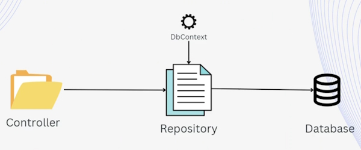
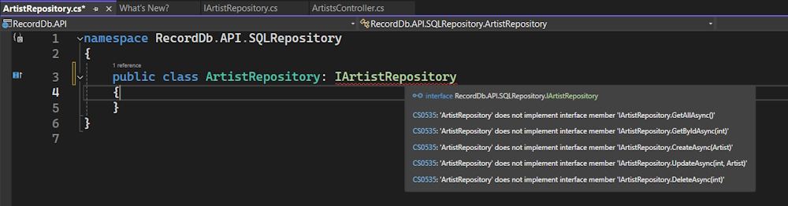

# The Repository Pattern and Automapper

## The Repository pattern


The Repository pattern is a design pattern that helps separate the data access layer from the rest of the application.

It provides a standard interface which is an interface class for accessing and managing data in a data store such as a database without exposing the underlying implementation detail to the rest of the application.

The Repository pattern typically involves creating an abstraction layer between the application and the data store which is implemented by a concrete Repository class.

The Repository class is responsible for creating CRUD operations on the data store and it exposes a set of methods that the application can use to interact with the data.



At the moment in our application we have the dbContext class injected inside the controller and it is the controller that is talking directly to the database using that context. That is not best practice and using the repository design pattern we can eliminate that and use an abstraction layer by adding that abstraction layer in between. Repositories can be added in between the controller and the database so that all the operations on the database is handled by the Repository.

The ``dbContext`` class is injected inside the Repository rather that inside the controller and it is the Repository that is then injected in the controller. So the controller will use the Repository instead of using the dbContext.

By doing that the controller now has no awareness of what is being called through the dbContext weather is is a SQL Server database, a MongoDb database or other database. It has no idea of where the data is coming from. It is just using the interface method exposed by the interface Repository and the implementation is hidden behind the implementation Repository.

Using that you can switch the logic and the data store behind the implementation Repository, for example you can use EntityFramework core to store your changes in a database or you can just use an in memory database by creating another  implementation Repository.

All of those changes are happening behind the Repository and the controller has no knowledge about the data store at all.

By using the Repository pattern in ASP.Net Core developers can achieve several benefits. They are decoupling the data access layer from the rest of the application which makes it easier to maintain and test the application providing a standard interface for accessing data which improves the consistency and readability of the code. Now every connection to the database goes through the Repository.

We can also improve the performance of the application by using caching or other optimisation techniques supporting multiple data sources which allow the application to switch between different data sources without affecting the application logic.

Overall the Repository pattern is powerful tool for managing data in ASP.Net Core applications.

### Implementing the Repository

We are using SQL Server so our Repository folder will be be named ``SqlRepository``. 

To implement the Repository we have to create an Interface Repository. In our case this will be the ``IArtistRepository`` and after we have exposed the interface which exposes the CRUD operations we would then need an implementation, a concrete Repository that would be used to implement all of these methods for us. This Repository will be named, ``ArtistRepository``.

Doing this will make it easy to swap out our data store, for example, an in-memory database in future.

#### IArtistRepository

Create a new Interface class named ``IArtistRepository``.

```bash
    public interface IArtistRepository
    {
        Task<List<Artist>> GetAllAsync();

        Task<Artist?> GetByIdAsync(int id);

        Task<Artist> CreateAsync(Artist artist);

        Task<Artist?> UpdateAsync(int id, Artist artist);

        Task<Artist?> DeleteAsync(int id);
    }
```

In the ``IArtistRepository`` we will end all method names with ``Async`` to make them different to the methods in the ``Artist`` controller.

Now create the ``ArtistRepository`` class and implement the Interface.

```bash
namespace RecordDb.API.SQLRepository
{
    public class ArtistRepository : IArtistRepository
    {
    }
}
```

If you mouse over ``IArtistRepository`` it will show this.



It is asking you to implement the Interface methods.

You can do this by a mouseover  the ``IArtistRepository`` word and click **Ctrl-.**, you will see the option ``Implement Interface``. Select this and it will scaffold all of the methods that you have in your ``IArtistInterface``.

You will end up with this.

```bash
    public class ArtistRepository : IArtistRepository
    {
        public Task<Artist> CreateAsync(Artist artist)
        {
            throw new NotImplementedException();
        }

        public Task<Artist?> DeleteAsync(int id)
        {
            throw new NotImplementedException();
        }

        public Task<List<Artist>> GetAllAsync()
        {
            throw new NotImplementedException();
        }

        public Task<Artist?> GetByIdAsync(int id)
        {
            throw new NotImplementedException();
        }

        public Task<Artist?> UpdateAsync(int id, Artist artist)
        {
            throw new NotImplementedException();
        }
    }
```

**Note:** it has made Async methods but left out the keyword ``async``. You will have to manually add these to each method.

Now we will work on our ``ArtistRepository`` class.

The first thing to do is add the ``RecordDbContext`` to the ``ArtistRepository`` constructor.

```bash
    private readonly RecordDbContext dbContext;

    public ArtistRepository(RecordDbContext dbContext)
    {
        this.dbContext = dbContext;
    }
```

### The ArtistRepository GetAllAsync() method

```bash
    public async Task<List<Artist>> GetAllAsync()
    {
        return await dbContext.Artist.ToListAsync();
    }
```

We removed this ``dbContext`` statement from the Artist Controllers ``GetAll()`` method. We then changed the statement in the ``GetAll()`` method to this.

```bash
    // GET data from the database - Domain Model
    var artists = await artistRepository.GetAllAsync();
```

### ArtistsController GetAll() method

```bash
	// GET: https://localhost:1234/api/artists
	[HttpGet]
	public async Task<IActionResult> GetAll()
	{
		// GET data from the database - Domain Model
		var artists = await artistRepository.GetAllAsync();
	
		// MAP Domain Model to DTO
		var artistsDto = new List<ArtistDto>();
	
		foreach (var artist in artists)
		{
			artistsDto.Add(new ArtistDto()
			{
				ArtistId = artist.ArtistId,
				FirstName = artist.FirstName,
				LastName = artist.LastName,
				Name = artist.Name,
				Biography = artist.Biography
			});
		}
	
		// Return the DTO back to the client
		return Ok(artistsDto);
	}
```

Basically, what we are doing in all of our CRUD methods is taking all ``dbContext`` calls from the ``ArtistsController`` class and placing them in the respective ``ArtistRepository`` class methods. We then rewrite the data calls in the ``ArtistsController`` class to connect to the ``ArtistRepository`` class and that class retrieves data from the data store and sends it back to the ``ArtistsController`` class.

### Inject ArtistRepository into ArtistsController

Now we have the ``GetAll()`` method setup and ready to test. We have one more thing to do to get it working. we need to inject it into our application.

Open ``Program.cs`` and after we inject the ``RecordDbContext`` we can also inject the ``ArtistRepository``.

```bash
    builder.Services.AddScoped<IArtistRepository, ArtistRepository>();
```

Now we will inject the ``artistRepository`` into the ``ArtistsController``

```bash
    private readonly RecordDbContext dbContext;
    private readonly IArtistRepository artistRepository;

    public ArtistsController(RecordDbContext dbContext, IArtistRepository artistRepository)
    {
        this.dbContext = dbContext;
        this.artistRepository = artistRepository;
    }
```

**Note:** we know that we have to remove the ``dbContext`` from the ``ArtistsController`` class. Leave it in the ``ArtistsController`` while we are working on the ``ArtistRepository`` class. Once we finish working on our CRUD methods in the ``ArtistRepository`` we can remove it. This will stop us from seeing errors in the Controller methods we haven't finished.

Now we can inject the ``ArtistRepository`` into the ``GetById()`` method in ``ArtistsController``.

### ArtistsController GetById() method

```bash
	// GET: https://localhost:1234/api/artists/114
	[HttpGet]
	[Route("{id:int}")]
	public async Task<IActionResult> GetById([FromRoute] int id)
	{
		// GET Artist Domain mode from database
		var artist = await artistRepository.GetByIdAsync(id);
	
		if (artist == null)
		{
			return NotFound($"An Artist with Id: {id} wasn't found!");
		}
	
		// Map Artist Domain model to ArtistDto
		var artistDto = new ArtistDto
		{
			ArtistId = artist.ArtistId,
			FirstName = artist.FirstName,
			LastName = artist.LastName,
			Name = artist.Name,
			Biography = artist.Biography
		};
	
		// Return the DTO back to the client 
		return Ok(artistDto);
	}
```

### ArtistRepository GetByIdAsync() method

```bash
    public async Task<Artist?> GetByIdAsync(int id)
    {
        return await dbContext.Artist.FirstOrDefaultAsync(a => a.ArtistId == id);
    }
```

### ArtistsController Create() method

```bash
    // POST: https://localhost:1234/api/artists
    [HttpPost]
    public async Task<IActionResult> Create([FromBody] AddArtistDto addArtistDto)
    {
        // Map DTO to Domain Model
        var artist = new Artist
        {
            FirstName = addArtistDto.FirstName,
            LastName = addArtistDto.LastName,
            Name = addArtistDto.Name,
            Biography = addArtistDto.Biography
        };

        // Use Domain Model to create Artist
        artist = await artistRepository.CreateAsync(artist);

        // Map Domain model back to DTO
        var artistDto = new ArtistDto
        {
            ArtistId = artist.ArtistId,
            FirstName = artist.FirstName,
            LastName = artist.LastName,
            Name = artist.Name,
            Biography = artist.Biography
        };

        return CreatedAtAction(nameof(GetById), new { id = artistDto.ArtistId }, artistDto);
    }
```

### ArtistRepository CreateAsync() method

```bash
    public async Task<Artist> CreateAsync(Artist artist)
    {
        await dbContext.Artist.AddAsync(artist);
        await dbContext.SaveChangesAsync();
        
        return artist;
    }
```

### ArtistsController Update() method

```bash
	[HttpPut]
	[Route("{id:int}")]
	public async Task<IActionResult> Update([FromRoute] int id, [FromBody] UpdateArtistDto updateArtistDto)
	{
		// Map DTO to Domain Model
		var artist = new Artist
		{
			FirstName = updateArtistDto.FirstName,
			LastName = updateArtistDto.LastName,
			Name = updateArtistDto.Name,
			Biography = updateArtistDto.Biography
		};
	
		artist = await artistRepository.UpdateAsync(id, artist);
	
		if (artist == null)
		{
			return NotFound($"Artist with Id: {id} wasn't found!");
		}
	
		// Convert Domain Model to DTO
		var artistDto = new ArtistDto
		{
			ArtistId = artist.ArtistId,
			FirstName = artist.FirstName,
			LastName = artist.LastName,
			Name = artist.Name,
			Biography = artist.Biography
		};
	
		return Ok(artistDto);
	}
```

### ArtistRepository UpdateAsync() method

```bash
    public async Task<Artist?> UpdateAsync(int id, Artist artist)
    {
        var existingArtist = await dbContext.Artist.FirstOrDefaultAsync(b => b.ArtistId == id)  
    
        if (existingArtist == null)
        {
            return null;
        }

        existingArtist.FirstName = artist.FirstName;
        existingArtist.LastName = artist.LastName;
        existingArtist.Name = artist.Name;
        existingArtist.Biography = artist.Biography 
    
        await dbContext.SaveChangesAsync()  
    
        return existingArtist;
    }
```

### ArtistsController Delete() method

```bash
	// DELETE: https://localhost:1234/api/artists/114
	[HttpDelete]
	[Route("{id:int}")]
	public async Task<IActionResult> Delete([FromRoute] int id)
	{
		var artist = await artistRepository.DeleteAsync(id);
	
		if (artist == null)
		{
			return NotFound($"Artist with Id: {id} not found!");
		}
	
		// Map the Domain Model to DTO
		var artistDto = new ArtistDto
		{
			ArtistId = artist.ArtistId,
			FirstName = artist.FirstName,
			LastName = artist.LastName,
			Name = artist.Name,
			Biography = artist.Biography
		};
	
		return Ok(artistDto);
	}
```

### ArtistRepository DeleteAsync() method

```bash
public async Task<Artist?> DeleteAsync(int id)
{
    var artist = await dbContext.Artist.FindAsync(id);
    if (artist == null)
    {
        return null;
    }

    dbContext.Artist.Remove(artist);
    await dbContext.SaveChangesAsync();

    return artist;
}
```

### Finish the ArtistController constructor

Remove the ``dbContext`` property from the ``ArtistsController`` class.

```bash
    private readonly IArtistRepository artistRepository;

    public ArtistsController(IArtistRepository artistRepository)
    {
        this.artistRepository = artistRepository;
    }
```

This completes the decoupling of the data store from the ``ArtistsController`` class.
