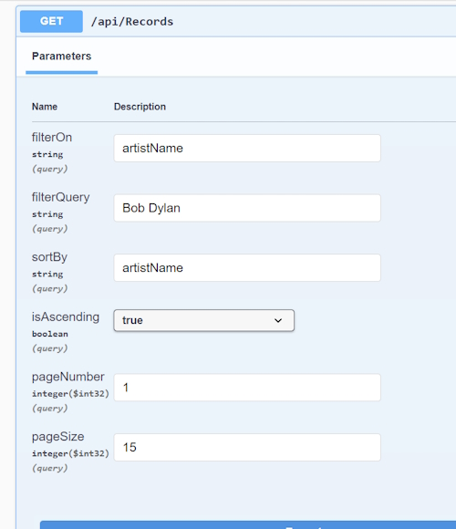

# Filtering, Sorting, Pagination in ASP.NET Core Web API

## Filtering

Filtering is common in ASP.Net Core. It allows us to return a subset of records rather than the complete set of records.

For example, we want to sort on the ``Field`` property in the ``Record`` entity. We need to add two query parameters to our ``IRecordRepository``, ``RecordRepository`` and ``RecordsController`` classes by changing the ``getAll()`` methods.

## Reducing data going back to the client

Even with filtering I am returning too much data to the client. The ``Artist`` entity has the ``Biography`` text field and the ``Record`` entity has the ``Review`` text field. These fields bring back a huge amount of data and make the output unreadable. I have found that I can use DTO's to reduce the amount of data being sent back to the client.

I have created a ``RecordQueryDto`` to remove the ``Review`` property from the output to the client.

Also note that I have to create an ``ArtistQueryDto`` and use it in the navigation field.

### RecordQueryDto

```bash
    public class RecordQueryDto
    {
        public int RecordId { get; set; }

        public int ArtistId { get; set; }

        public string Name { get; set; }

        public string Field { get; set; }

        public int Recorded { get; set; }

        public string Label { get; set; }

        public string Pressing { get; set; }

        public string Rating { get; set; }

        public int Discs { get; set; }

        public string Media { get; set; }

        public DateTime? Bought { get; set; }

        public decimal? Cost { get; set; }

        public string? CoverName { get; set; }

        public ArtistQueryDto Artist { get; set; }
    }
```

I remove the ``Biography`` property from the ``ArtistQueryDto`` model.

### ArtistQueryDto

```bash
    public class ArtistQueryDto
    {
        [Required]
        public int ArtistId { get; set; } // identity field

        public string? FirstName { get; set; }

        [Required]
        public string LastName { get; set; }

        [Required]
        public string Name { get; set; }
    }
```

Now that I have created two new DTO's I have to add two mappings to the ``AutoMapperProfiles`` class.

```bash
    CreateMap<Artist, ArtistQueryDto>().ReverseMap();
    CreateMap<Record, RecordQueryDto>().ReverseMap();
```

All I have to do now is change the ``RecordsController`` method, ``GetAll()`` to use the ``RecordQueryDto`` mapping for output.

**Note:** you can create new DTO's that reduce the number of fields in the original entities. For example, I have ``RecordDto`` to output the full ``Record`` entity and I created ``RecordQueryDto`` which is missing the ``Review`` field. Automapper is smart enough to realise that they are the same entity so ignore the ``Review`` property in the JSON output.

### RecordsController

```bash
    // GET: https://localhost:1234/api/records
    [HttpGet]
    public async Task<IActionResult> GetAll([FromQuery] string? filterOn, [FromQuery] string? filterQuery)
    {
        // GET data from the database - Domain Model
        var records = await recordRepository.GetAllAsync(filterOn, filterQuery);
    
        // Return the DTO back to the client
        return Ok(mapper.Map<List<RecordQueryDto>>(records));
    }
```

We are retrieving the parameters from the Query string so require the ``[FromQuery]`` attribute. Both parameters can be nullable strings so we can add a ``?`` to the end of the types.

### IRecordRepository

```bash
    Task<List<Record>> GetAllAsync(string? filterOn = null, string? filterQuery = null);
```

### RecordRepository

```bash
    public async Task<List<Record>> GetAllAsync(string? filterOn = null, string? filterQuery = null)
    {
        var records = dbContext.Record.Include("Artist").AsQueryable(); 
    
        // Filtering
        if (string.IsNullOrWhiteSpace(filterOn) == false && string.IsNullOrWhiteSpace(filterQuery) == false)
        {
            if (filterOn.Equals("Field", StringComparison.OrdinalIgnoreCase))
            {
                records = records.Where(r => r.Field.Contains(filterQuery));
            }
        }   
    
        return await records.ToListAsync();
    }
```

**Note:** The ``dbContext`` statement retrieves all ``Artist`` and ``Record`` entities. While this is relatively fast the process of sending all records as JSON to the webpage is very slow. I should be able to mitigate this by filtering, then using pagination to limit the number of records being sent to the web page.

**Note** in ``GetAllAsync()`` above that I only have one option to filter and there are a number of other fields that I should be able to filter on.

I can improve on this by moving the filtering to another method so that I don't clutter the ``GetAllAsync()`` method.

Now I can filter on all the properties that require it.

### GetAllAsync()

```bash
    public async Task<List<Record>> GetAllAsync(string? filterOn = null, string? filterQuery = null)
    {
        var records = dbContext.Record.Include("Artist").AsQueryable();

        // Filtering
        if (string.IsNullOrWhiteSpace(filterOn) == false && string.IsNullOrWhiteSpace(filterQuery) == false)
        {
            records = FilterRecords(records, filterOn, filterQuery);
        }

        return await records.ToListAsync();
    }
```

### FilterRecords()

```bash
    private IQueryable<Record> FilterRecords(IQueryable<Record> records, string filterOn, string filterQuery)
    {
        if (filterOn.Equals("Field", StringComparison.OrdinalIgnoreCase))
        {
            records = records.Where(r => r.Field.Contains(filterQuery));
        }
        else if (filterOn.Equals("Media", StringComparison.OrdinalIgnoreCase))
        {
            records = records.Where(r => r.Media.Contains(filterQuery));
        }
        else if (filterOn.Equals("Review", StringComparison.OrdinalIgnoreCase))
        {
            string pattern = "%" + filterQuery + "%";
            records = records.Where(r => EF.Functions.Like(r.Review, pattern));
        }
        else if (filterOn.Equals("Name", StringComparison.OrdinalIgnoreCase))
        {
            string pattern = "%" + filterQuery + "%";
            records = records.Where(r => EF.Functions.Like(r.Name, pattern));
        }
        else if (filterOn.Equals("ArtistName", StringComparison.OrdinalIgnoreCase))
        {
            string pattern = "%" + filterQuery + "%";
            records = records.Where(r => EF.Functions.Like(r.Artist.Name, pattern));
        }
        else if (filterOn.Equals("Recorded", StringComparison.OrdinalIgnoreCase))
        {
            records = records.Where(r => r.Recorded.Equals(int.Parse(filterQuery)));
        }        

        return records;
    }
```

## Sorting

We will sort on the ``Artist.LastName``, ``Artist.FirstName`` and ``Recorded`` fields in ``RecordRepository()``.

We will add two more query parameters, ``sortBy`` (artistName) for the field name and ``isAscending``, a boolean for the sort direction. With ``true`` for ascending.

Once again we need add these query parameters to our ``IRecordRepository``, ``RecordRepository`` and ``RecordsController`` classes by changing the ``getAll()`` methods.

### RecordsController

```bash
// GET: https://localhost:1234/api/records?filterOn=field&filterQuery=recorded&sortOn=name&isAscending
[HttpGet]
public async Task<IActionResult> GetAll([FromQuery] string? filterOn, [FromQuery] string? filterQuery, 
    [FromQuery] string?  sortBy, [FromQuery] bool isAscending)
{
    // GET data from the database - Domain Model
    var records = await recordRepository.GetAllAsync(filterOn, filterQuery, sortBy, isAscending);

    // Return the DTO back to the client
    return Ok(mapper.Map<List<RecordQueryDto>>(records));
}
```

### IRecordRepository

```bash
    Task<List<Record>> GetAllAsync(string? filterOn = null, string? filterQuery = null, 
        string? sortBy = null, bool isAscending = true);
```

### RecordRepository

```bash
public async Task<List<Record>> GetAllAsync(string? filterOn = null, string? filterQuery = null, string?
    sortBy = null, bool isAscending = true)
{
    var records = dbContext.Record.Include("Artist").AsQueryable();

    // Filtering
    if (string.IsNullOrWhiteSpace(filterOn) == false && string.IsNullOrWhiteSpace(filterQuery) == false)
    {
        records = FilterRecords(records, filterOn, filterQuery);
    }

    // Sorting
    if (string.IsNullOrWhiteSpace(sortBy) == false)
    {
        if (sortBy.Equals("artistName", StringComparison.OrdinalIgnoreCase))
        {
            records = isAscending ? records.OrderBy(r => r.Artist.LastName).
                ThenBy(r => r.Artist.FirstName).ThenBy(r => r.Recorded) : 
                records.OrderBy(r => r.Artist.LastName).ThenBy(r => r.Artist.FirstName).
                ThenByDescending(r => r.Recorded);
        }
    }

    return await records.ToListAsync();
}
```

**Note:** If using a descending sort I am sorting by ``LastName``, ``FirstName`` ascending and then I sort the ``Recorded`` by descending.

## Pagination

Pagination is limiting the number of records that will be shown on a web page. It requires two parameters, ``pageNumber`` and ``pageSize``. Once again these will have to be added to the ``GetAll()`` methods in the ``IRecordRepository``, ``RecordRepository`` and ``RecordsController`` classes.

### RecordsController

```bash
    // GET: https://localhost:1234/api/records?filterOn=field&filterQuery=recorded&sortOn=name&isAscending=true&    ageNumber=1,pageSize=15
    [HttpGet]
    public async Task<IActionResult> GetAll([FromQuery] string? filterOn, [FromQuery] string? filterQuery, 
        [FromQuery] string? sortBy, [FromQuery] bool? isAscending, 
        [FromQuery] int pageNumber = 1, [FromQuery] int pageSize = 15)
    {
        // GET data from the database - Domain Model
        var records = await recordRepository.GetAllAsync(filterOn, filterQuery, sortBy, 
                isAscending ?? true, pageNumber, pageSize);

        // Return the DTO back to the client
        return Ok(mapper.Map<List<RecordQueryDto>>(records));
    }
```

### IRecordRepository

```bash
Task<List<Record>> GetAllAsync(string? filterOn = null, string? filterQuery = null, string? sortBy = null, 
        bool isAscending = true, int pageNumber = 1, int pageSize = 15);
```

### RecordRepository

```bash
    public async Task<List<Record>> GetAllAsync(string? filterOn = null, string? filterQuery = null, string?
        sortBy = null, bool isAscending = true, int pageNumber = 1, int pageSize = 15)
    {
        var records = dbContext.Record.Include("Artist").AsQueryable()  
    
        // Filtering
        if (string.IsNullOrWhiteSpace(filterOn) == false && string.IsNullOrWhiteSpace(filterQuery) == false)
        {
            records = FilterRecords(records, filterOn, filterQuery);
        }

        // Sorting
        if (string.IsNullOrWhiteSpace(sortBy) == false)
        {
            if (sortBy.Equals("artistName", StringComparison.OrdinalIgnoreCase))
            {
                records = isAscending ? records.OrderBy(r => r.Artist.LastName).ThenBy(r => r.Artist.FirstName).ThenBy( => r.Recorded) : 
                    records.OrderBy(r => r.Artist.LastName).ThenBy(r => r.Artist.FirstName).ThenByDescendi  (r => r.Recorded);
            }
        }

        // Pagination
        var skipResults = (pageNumber - 1) * pageSize   
        
        return await records.Skip(skipResults).Take(pageSize).ToListAsync();
    }
```

We are using the calculation for skipping results ``(pageNumber - 1) * pageSize``.

We use ``Skip()`` and ``Take()`` to navigate through the set of records.

To test this out use these parameters.



We produce these results.

```bash
    [
      {
        "recordId": 263,
        "artistId": 114,
        "name": "Bob Dylan",
        "field": "Folk",
        "recorded": 1961,
        "label": "CBS",
        "pressing": "Aus",
        "rating": "****",
        "discs": 1,
        "media": "CD",
        "bought": "1989-01-09T00:00:00",
        "cost": 10,
        "coverName": "dylan-dylan.jpg",
        "artist": {
          "artistId": 114,
          "firstName": "Bob",
          "lastName": "Dylan",
          "name": "Bob Dylan"
        }
      },
      {
        "recordId": 264,
        "artistId": 114,
        "name": "Bob Dylan",
        "field": "Folk",
        "recorded": 1961,
        "label": "CBS",
        "pressing": "Aus",
        "rating": "****",
        "discs": 1,
        "media": "R",
        "bought": "1900-01-01T00:00:00",
        "cost": 0,
        "coverName": "dylan-dylan.jpg",
        "artist": {
          "artistId": 114,
          "firstName": "Bob",
          "lastName": "Dylan",
          "name": "Bob Dylan"
        }
      },
      {
        "recordId": 1814,
        "artistId": 114,
        "name": "The Harry Belafonte Sessions",
        "field": "Folk",
        "recorded": 1961,
        "label": "Bootleg",
        "pressing": "Am",
        "rating": "**",
        "discs": 1,
        "media": "CD",
        "bought": "2006-03-17T00:00:00",
        "cost": 0,
        "coverName": null,
        "artist": {
          "artistId": 114,
          "firstName": "Bob",
          "lastName": "Dylan",
          "name": "Bob Dylan"
        }
      },
      {
        "recordId": 1728,
        "artistId": 114,
        "name": "Live At The Gaslight 1962",
        "field": "Folk",
        "recorded": 1962,
        "label": "Starbucks",
        "pressing": "Am",
        "rating": "****",
        "discs": 1,
        "media": "CD",
        "bought": "2006-01-22T00:00:00",
        "cost": 0,
        "coverName": null,
        "artist": {
          "artistId": 114,
          "firstName": "Bob",
          "lastName": "Dylan",
          "name": "Bob Dylan"
        }
      },
      {
        "recordId": 1135,
        "artistId": 114,
        "name": "The Freewheelin'",
        "field": "Folk",
        "recorded": 1962,
        "label": "Columbia",
        "pressing": "Am",
        "rating": "****",
        "discs": 1,
        "media": "CD",
        "bought": "1998-07-03T00:00:00",
        "cost": 13,
        "coverName": "dylan-free.jpg",
        "artist": {
          "artistId": 114,
          "firstName": "Bob",
          "lastName": "Dylan",
          "name": "Bob Dylan"
        }
      },
      {
        ...
      }
    ]
```

## Add filtering, sorting & pagination to Artists

### ArtistsController

```bash
// GET: https://localhost:1234/api/artists?filterOn=field&filterQuery=recorded&sortOn=name&isAscending=true&pageNumber=1,pageSize=15
[HttpGet]
public async Task<IActionResult> GetAll([FromQuery] string? filterOn, [FromQuery] string? filterQuery,
    [FromQuery] string? sortBy, [FromQuery] bool? isAscending,
    [FromQuery] int pageNumber = 1, [FromQuery] int pageSize = 15)
{
    // GET data from the database - Domain Model
    var artists = await artistRepository.GetAllAsync(filterOn, filterQuery, sortBy, isAscending ?? true, pageNumber, pageSize);

    // Return the DTO back to the client
    return Ok(mapper.Map<List<ArtistQueryDto>>(artists));
}
```

### IArtistRepository

```bash
Task<List<Artist>> GetAllAsync(string? filterOn = null, string? filterQuery = null, 
    string? sortBy = null, bool isAscending = true, int pageNumber = 1, int pageSize = 15);
```

### ArtistRepository

```bash
public async Task<List<Artist>> GetAllAsync(string? filterOn = null, string? filterQuery = null, 
    string? sortBy = null, bool isAscending = true, int pageNumber = 1, int pageSize = 15)
{
    var artists = dbContext.Artist.AsQueryable();

    // Filtering
    if (string.IsNullOrWhiteSpace(filterOn) == false && string.IsNullOrWhiteSpace(filterQuery) == false)
    {
        if (filterOn.Equals("Name", StringComparison.OrdinalIgnoreCase))
        {
            string pattern = "%" + filterQuery + "%";
            artists = artists.Where(r => EF.Functions.Like(r.Name, pattern));
        }

    }

    // Sorting
    if (string.IsNullOrWhiteSpace(sortBy) == false)
    {
        if (sortBy.Equals("Name", StringComparison.OrdinalIgnoreCase))
        {
            artists = isAscending ? artists.OrderBy(r => r.LastName).ThenBy(r => r.FirstName) : artists.OrderByDescending(r => r.LastName).ThenBy(r => r.FirstName);
        }
    }

    // Pagination
    var skipResults = (pageNumber - 1) * pageSize;

    return await artists.Skip(skipResults).Take(pageSize).ToListAsync();
}
```

Do a test.


Results.

```bash
    [
      {
        "artistId": 528,
        "firstName": "Mick",
        "lastName": "Abrahams",
        "name": "Mick Abrahams"
      },
      {
        "artistId": 821,
        "firstName": "Geoff",
        "lastName": "Achison",
        "name": "Geoff Achison"
      },
      {
        "artistId": 1,
        "firstName": "William",
        "lastName": "Ackerman",
        "name": "William Ackerman"
      },
      {
        "artistId": 498,
        "firstName": "Ryan",
        "lastName": "Adams",
        "name": "Ryan Adams"
      },
      {
        "artistId": 3,
        "firstName": "Duane",
        "lastName": "Allman",
        "name": "Duane Allman"
      },
      {
        "artistId": 4,
        "firstName": "Gregg",
        "lastName": "Allman",
        "name": "Greg Allman"
      },
      {
        "artistId": 2,
        "firstName": "The",
        "lastName": "Allman Brothers Band",
        "name": "The Allman Brothers Band"
      },
      {
        ...
      }
    ]
```

.
